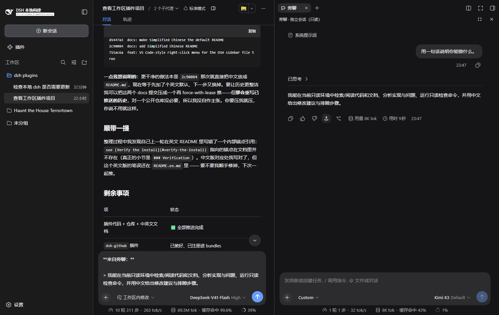

# dsh-side-chat-plus

**简体中文** · [English](README_EN.md)

在 DeepSeek Harness 的主会话旁边，开一个**独立的旁聊会话**：不污染主会话上下文、默认只读、可随时把答案带回主会话。



## 这是什么

主会话正在跑长任务时，你随时可以打开右栏的「旁聊」标签页，问一个顺便的问题：

- 它看到主会话的背景（按需检索），但对话**不会**写进主会话
- 它是一个**真实的独立会话**——有自己的 transcript、自己的模型、自己的工具
- 默认**只读**：能读文件、搜索、查资料，不能改动工作区（沙箱强制 + 审批关闭）
- 答案有用？点一下 ↗ **带到主会话**，引用块直接进入主会话输入框草稿

旁聊的会话界面就是官方那套——原生输入框、Markdown、附件、`@` 引用、模型选择器、工具卡片，全部一致。

## 要求

- **dsh ≥ 0.1.6-alpha.2**（面板用到了这版才引入的显式会话绑定能力）
- Node.js ≥ 22（仅开发时需要）

## 安装

```powershell
dsh plugin --profile web add ./dsh-side-chat-plus-1.0.0.tgz
```

然后重启 `dsh web`。

## 使用

1. 打开任意主会话 → 点会话头部的 🗨 按钮（或在右栏引导页找到「旁聊」）
2. 右栏出现「旁聊」标签页：直接在里面提问
3. 旁聊需要主会话背景时会自己调用 `side_chat_context` 工具按需检索
4. 回答下方的 ↗ 把该条回答以引用块带进主会话草稿
5. 面板右上角：✥ 在主窗口打开（完整原生界面）；✕ 关闭（可选保留/删除）

旁聊会话不出现在左侧会话列表里（归档隐藏）；设置 → 已归档会话 里可以找回。

## 设置（设置 → 旁聊）

| 选项 | 默认 | 说明 |
|---|---|---|
| 启用旁聊 | 开 | 关闭后隐藏全部入口 |
| 只读模式 | **开** | 关掉后旁聊拥有完整工具能力（可写工作区） |
| 新旁聊模式 | 标准模式 | 使用 DSH 原生 agent 预设（standard / ptc / minimal / cordis） |
| 关闭旁聊时 | 每次询问 | 可改为始终保留 / 始终删除 |

## 架构

- **Host**：创建/恢复一个带 `parentSession` 的真实会话并立即归档；写入 `sandbox/mode=read-only` + `approval/policy=never` 实现只读；注册 `side_chat_context` 工具供旁聊按需检索主会话上下文；`/side-chat` 前缀路由复用官方 Host/Origin + cookie 信任栅栏。
- **Client**：官方右栏 tab（`sidebarRightTabs` + `sidebar.right.pane.tab`），内容区通过 `SessionProvider session={sessions.retain(id)}` 绑定侧聊会话，渲染官方 `conversation.content`（embedded 变体）——输入框、消息流、模型选择器都是官方组件。

## 致谢与许可

基于 [KarlOfLaw/dsh-side-chat](https://github.com/KarlOfLaw/dsh-side-chat)（MIT）改造。本仓库保留其 MIT 许可声明（见 [LICENSE](LICENSE)）。

MIT License
