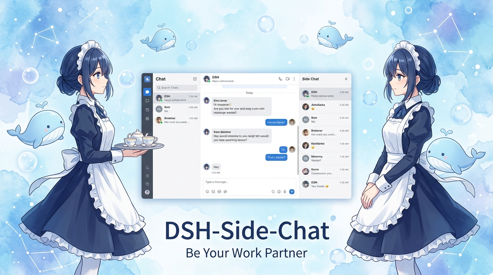
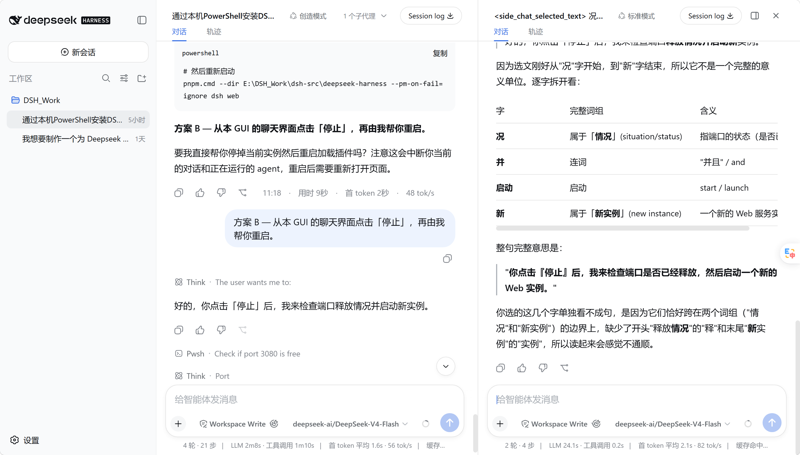
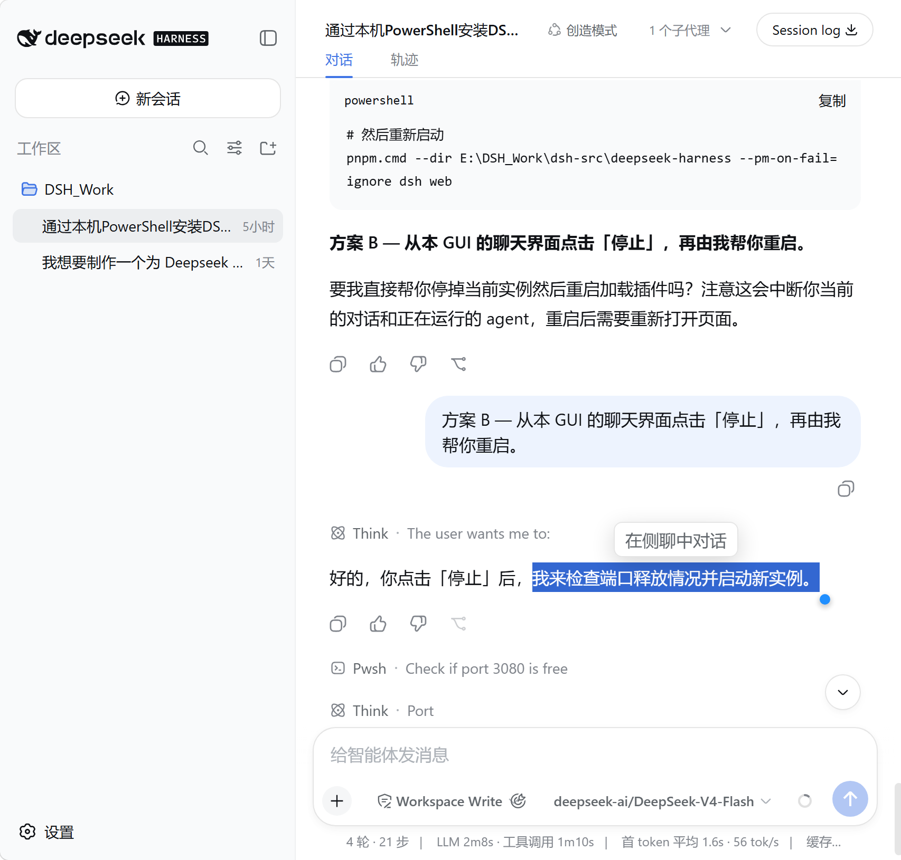
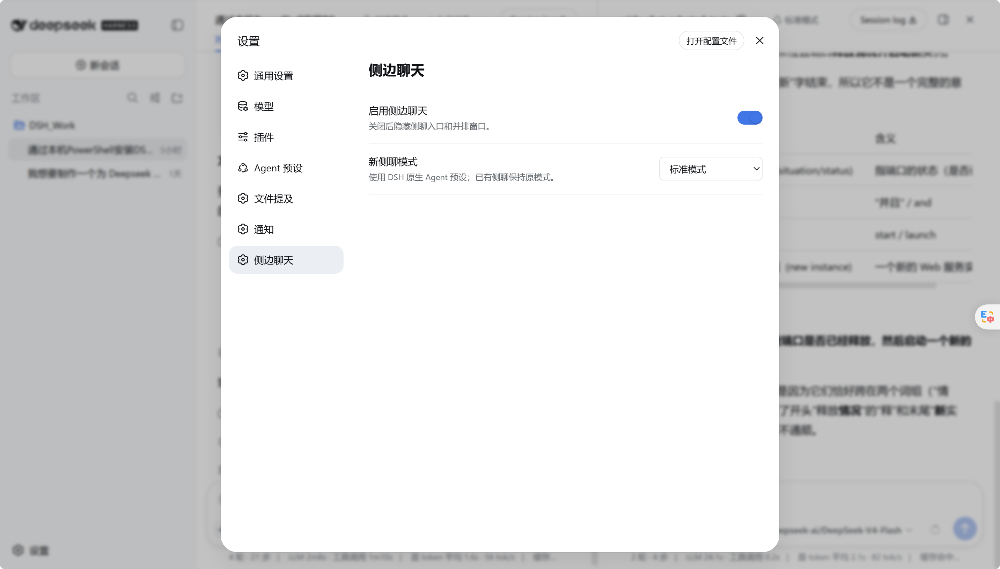

# DSH Side Chat

<p align="center">
  <strong>简体中文</strong> · <a href="README_EN.md">English</a>
</p>

<p align="center">
  
</p>

<p align="center">
  <a href="release/dsh-side-chat-1.1.0.tgz"></a>
  <a href="LICENSE"></a>
  
  
</p>

<p align="center">
  <strong>在 DeepSeek Harness 主对话旁边，打开一个真正独立、原生、理解上下文的并行对话。</strong>
</p>

<p align="center">
  <a href="#界面预览">界面预览</a> ·
  <a href="#核心能力">核心能力</a> ·
  <a href="#快速开始">快速开始</a> ·
  <a href="#使用方式">使用方式</a> ·
  <a href="#架构边界">架构边界</a>
</p>

> [!NOTE]
> 侧聊不是浮在主对话上方的临时面板，也不是手写的聊天界面。它是一个真实 DSH Session，直接复用 DSH 原生会话组件，并通过有界工具按需理解主对话。

## 界面预览



主对话与侧聊使用同一套 DSH 原生会话界面。中间分隔线可以拖动，两个输入框保持对齐，侧聊不会出现在左侧会话列表。

| 主对话选文入口 | 原生设置页 |
| --- | --- |
|  |  |

## 核心能力

| 能力 | 实现方式 |
| --- | --- |
| **真实独立会话** | 通过 DSH `agents.create/resume` 创建带 `parentSession` 的 Session，不占用 subagent routing。 |
| **完整原生 UI** | 左右两栏都渲染完整 `ConversationRoot`；消息、工具、审批、附件、输入框、模型和权限控件继续由 DSH 提供。 |
| **按需理解主对话** | 不复制主 transcript。需要背景时，通过 `side_chat_context` 检索有界、相关的父会话片段。 |
| **真正并排** | 只增加最小 split shell；分隔条支持拖拽和方向键微调，侧聊占比限制在 25%–70%。 |
| **不污染会话列表** | 新侧聊立即归档，不出现在 workspace 左侧列表中。 |
| **选文即问** | 选中主消息文字后出现“在侧聊中对话”，引用以可删除 chip 进入原生输入框。 |
| **可隐藏、可保留** | 隐藏只收起面板；关闭时明确提示默认删除，并提供保留对话选项。 |
| **原生模式与模型** | 新侧聊默认标准模式，可选 PTC、极简或创造模式；模型选择器保持 DSH 原生行为。 |

## 架构边界

host 只增加侧聊需要的生命周期与上下文能力：

```text
主 Session
  └─ archived side Session (parentSession=主 Session)
       ├─ 原生 DSH Agent / preset / tools / approvals
       ├─ 独立 transcript
       └─ side_chat_context → 按需读取父会话的相关上下文
```

client 保留 DSH 已注册的原生 conversation component，只把它放进两个会话绑定中。插件没有自己的消息 renderer，也没有自己的 composer 实现。当前 DSH 没有公开“渲染任意 session 的完整 conversation”入口，因此 arbitrary-session 绑定使用现有 `SessionProvider` 的 BindingContext seam；若 DSH 改动该内部 seam，插件会明确失败，而不会退回手写聊天 UI。

## 快速开始

### 直接安装正式包

下载仓库 `release/` 中已经构建好的插件，无需在安装阶段运行构建脚本：

```powershell
dsh plugin --profile web add .\release\dsh-side-chat-1.1.0.tgz
```

### 从源码构建

```powershell
git clone https://github.com/KarlOfLaw/dsh-side-chat.git
cd dsh-side-chat
npm test

$DshSource = "D:\path\to\deepseek-harness"
$PluginSource = (Get-Location).Path
pnpm --dir $DshSource dsh plugin --profile web add $PluginSource
pnpm --dir $DshSource dsh web
```

已安装时：

```powershell
npm test
pnpm --dir $DshSource dsh plugin --profile web update dsh-side-chat
```

`npm test` 会构建动态产物、正式本地包，并运行 core、host integration、client contract 与 smoke tests。

## 使用方式

1. 打开一个主会话，点击 header 中的消息气泡＋图标。
2. 拖动中间分隔线调整比例；聚焦分隔线后可用方向键微调，`Shift` 加速。
3. 点击侧聊顶部的面板图标可隐藏；主 header 的消息气泡图标可恢复。
4. 在主消息中选中文字，点击“在侧聊中对话”，选区会作为可删除的引用 chip 进入侧聊输入框。
5. 在设置的“侧边聊天”页面切换插件或默认 Agent 模式。
6. 点击 X 关闭侧聊，再选择保留或删除；默认提示删除且不存档。

## 目录

```text
src/core.mjs          纯函数：side id、上下文筛选与 retained child 选择
src/host.template.js  DSH child 生命周期、上下文工具、关闭/保留/删除
src/client.js         原生 ConversationRoot 双绑定与最小 split shell
dev/                  隔离 DSH profile、构建与本地验收种子
tests/                core、integration、client contract、smoke
```

## License

MIT。参考的 DeepSeek Harness checkout 同为 MIT。
